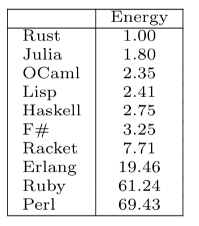

# Intro

The Julia language is recently new; the website https://julialang.org/ gives a short overview of Julia:
## 1. Fast (and energy efficient)
Julia was designed for high performance. Julia programs automatically compile to efficient native code via LLVM, and support multiple platforms.

This also translates to energy efficiency; when taking C as the benchmark, Julia scores 1.8, while Python is among one of the least efficient languages with a score of 75.88. (full benchmarks, see [here](https://sites.google.com/view/energy-efficiency-languages)

Considering we will be teaching students, let's estimate they will be programming between 4 (2^2) and 32 (2^5) hours a week, a reasonable estimate would be that on average they will program 2^3.5 = 11 hours a week. This is a significant amount of programming that will be done every year by our students (11 hours *42 weeks * 30 students = 14000 hours per year for the next 10-30 consecutive years for every class we teach). Reducing energy-efficiency by a factor of almost 40 will have a significant impact on the environment.

## 2. Reproducible environments
Julia handles environments quite different, compared to what you might be used to in Python.

Every dependency is installed into a single, central location. Once. Contrast this to Python where every environment has it's own copy of the same package...

## 3. General purpose
Julia provides asynchronous I/O, metaprogramming, debugging, logging, profiling, a package manager, and more. One can build entire Applications and Microservices in Julia.

### Machine learning ecosystem
Most important, from the perspective as a datascientist: Julia is developped by MIT, and adopted by a lot of universities. The ecosystem for data science is wide and very solid. Consider that Julia is being used by NASA and the Brazilian INPE for space missions.

The development of programming languages has come a long way since the development of Python. But some languages (eg, Rust) just don't have an ecosystem for datascience and machinelearning. Because you dont want to invent the wheel over and over again, you do need a scientific community that builds pacakges on top of the base language.

## 4. Dynamically typed and Composable
Julia is dynamically typed, feels like a scripting language, and has good support for interactive use, but can also optionally be separately compiled.

Julia uses multiple dispatch as a paradigm, making it easy to express many object-oriented and functional programming patterns. The talk on the [Unreasonable Effectiveness of Multiple Dispatch](https://www.youtube.com/live/kc9HwsxE1OY) explains why it works so well, but we will dive into what this is, how it works and why it is usefull during this crash course.

# Read more
1. [installation](docs/installation.md)
2. [REPL](docs/REPL.md)
3. [Puzzle](docs/puzzle.md)

